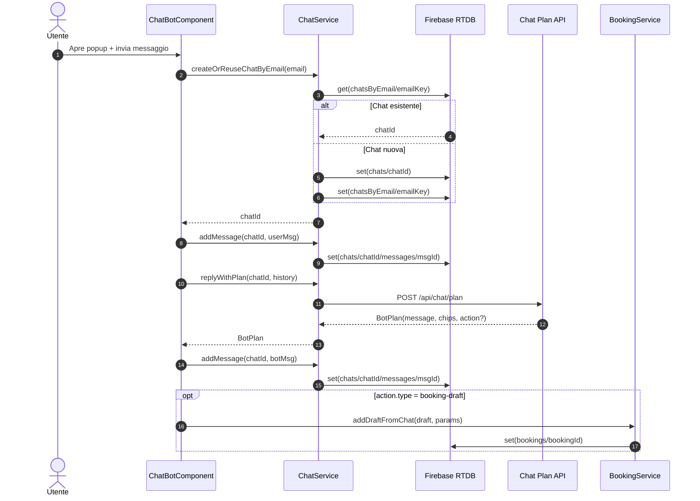
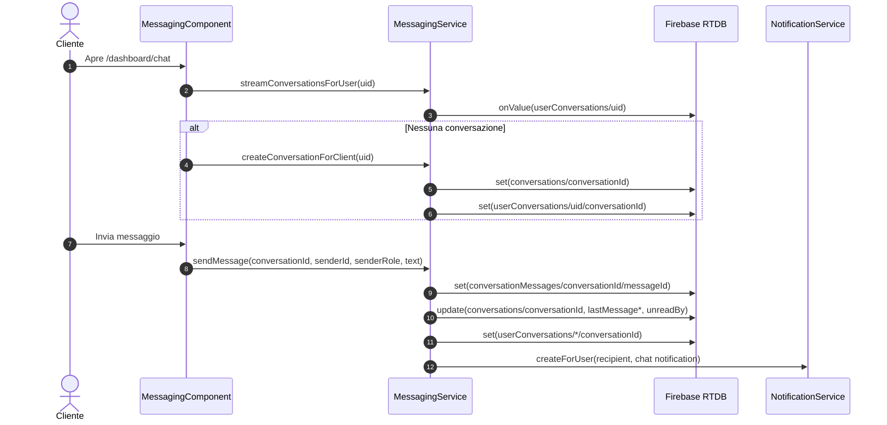
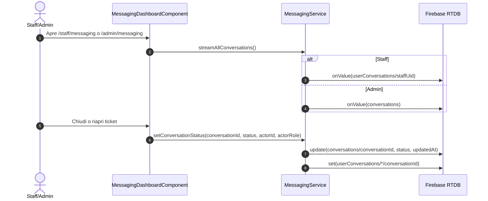
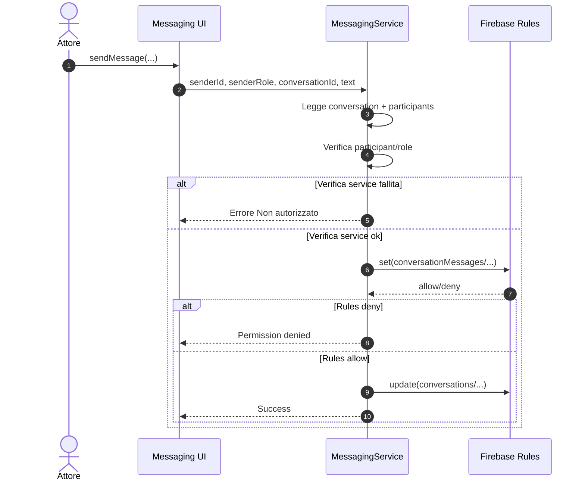

# 09 - HLD Chat: Flow, Ruoli e Simulazioni

## Obiettivo
Definire High Level Design del dominio chat in stato attuale (As-Is), con:
- flow end-to-end
- matrice ruoli e permessi
- simulazioni operative di conversazione

## Scope
Il documento copre due sottosistemi distinti:
- Chatbot pubblico (`chats`, `chatsByEmail`)
- Messaging ticket cliente/staff/admin (`conversations`, `conversationMessages`, `userConversations`)

## Architettura Logica

### Componenti principali
- UI globale chatbot: `src/app/shared/components/chat-bot/chat-bot.component.ts`
- Chatbot service: `src/app/core/services/chatBot/chat-bot.service.ts`
- UI messaging cliente: `src/app/features/clients/components/messaging/messaging.component.ts`
- UI messaging staff/admin: `src/app/features/admin/components/messaging-dashboard/messaging-dashboard.component.ts`
- Messaging service: `src/app/core/services/messaging/messaging.service.ts`
- Notification service: `src/app/core/services/notifications/notification.service.ts`
- Booking integration (draft da bot): `src/app/core/services/bookings/booking.service.ts`

### Dati RTDB coinvolti
- `chats/{chatId}`
- `chatsByEmail/{emailKey}`
- `conversations/{conversationId}`
- `conversationMessages/{conversationId}/{messageId}`
- `userConversations/{uid}/{conversationId}`
- `notifications/{uid}/{notificationId}`
- `bookings/{bookingId}` (solo per draft da chatbot)

## Flow 1 - Chatbot Pubblico (As-Is)

### Trigger
- Popup globale sempre disponibile in app root.

### Sequenza
1. Utente apre popup chatbot.
2. Se autenticato: usa `user.email`; se non autenticato: prompt email.
3. `ChatService.createOrReuseChatByEmail(email)`:
   - cerca indice in `chatsByEmail/{emailKey}`
   - se assente crea `chats/{chatId}` e salva indice
4. UI sottoscrive `getMessages(chatId)` su `chats/{chatId}/messages`.
5. Utente invia testo.
6. `replyWithPlan(chatId, history)`:
   - prepara contesto artisti/disponibilita
   - chiama proxy backend `POST /api/chat/plan`
   - fallback locale se proxy non disponibile
7. Bot risponde con testo/chips.
8. Se `plan.action.type === booking-draft`, UI chiama `bookingService.addDraftFromChat(...)`.

### Output
- Conversazione persistita su `chats/*`.
- Eventuale bozza booking persistita su `bookings/*`.

### Sequence Diagram (Mermaid)

## Flow 2 - Messaging Ticket Cliente/Staff/Admin (As-Is)

### Trigger cliente
1. Cliente entra in `/dashboard/chat` o `/dashboard/ticket`.
2. Bootstrap utente autenticato (`AuthService.resolveCurrentUser`).
3. Stream indice conversazioni da `userConversations/{uid}`.
4. Se nessuna conversazione, crea conversation base (`createConversationForClient`).

### Trigger staff/admin
1. Staff/admin entra in `/staff/messaging` o `/admin/messaging`.
2. Guard route:
   - staff: richiede `canManageMessages`
   - admin: accesso consentito
3. Staff vede stream personale; admin vede stream globale.

### Sequenza invio messaggio
1. UI chiama `messaging.sendMessage(...)`.
2. Service verifica accesso alla conversation.
3. Scrive messaggio in `conversationMessages/{conversationId}/{messageId}`.
4. Aggiorna metadata conversation:
   - `lastMessageAt`, `lastMessageBy`, `lastMessageText`, `unreadBy`
5. Allinea indice `userConversations/*` per i partecipanti.
6. Genera notifiche chat per i recipient.

### Sequenza cambio stato
1. UI chiama `setConversationStatus(conversationId, open|closed, actorId, actorRole)`.
2. Service valida ruolo (admin/staff) e ownership staff.
3. Scrive stato su `conversations/{conversationId}`.

### Sequence Diagram Cliente (Mermaid)

### Sequence Diagram Staff/Admin (Mermaid)

## Ruoli e Permessi (As-Is)

| Azione | Guest non autenticato | Client autenticato | Staff | Admin |
|---|---|---|---|---|
| Usare popup chatbot UI | Si | Si | Si | Si |
| Scrivere su `chats/*` | No (rules) | Si | Si | Si |
| Creare bozza booking da bot | No (rules) | Si (owner su booking creato) | Si | Si |
| Vedere own ticket messaging | No | Si | Si (solo conversazioni assegnate) | Si |
| Vedere tutte le conversazioni | No | No | No (solo proprie) | Si |
| Inviare messaggi conversation | No | Si (se participant) | Si | Si |
| Chiudere/riaprire conversation | No | No | Si (se assegnato) | Si |
| Archiviare conversation per utente | No | Si (own index) | Si | Si |

### Fonti autorizzative
- Guards frontend:
  - `AuthGuard`, `AdminGuard`, `StaffPermissionGuard`
- Logica service:
  - `MessagingService` check participant/role
- RTDB rules:
  - `conversations`, `conversationMessages`, `userConversations`, `chats`, `chatsByEmail`

### Sequence Diagram Autorizzazione Messaggio (Mermaid)

### Gap noti As-Is
- Nel messaging alcuni controlli usano parametri `senderRole`/`actorRole` forniti dal client e non solo identita server-side.
- Chatbot anonimo lato UI e consentito, ma non puo persistere dati con regole correnti (`auth != null` su `chats*`).

## Simulazioni Chat

## Simulazione 1 - Cliente autenticato, bot con bozza prenotazione
- Preconditions:
  - utente autenticato con `uid` e `email`
  - almeno uno staff attivo
- Input utente:
  - "vorrei una consulenza martedi alle 15"
- Esito atteso:
  - messaggio utente salvato in `chats/{chatId}/messages`
  - risposta bot con chips
  - se action `booking-draft`: creazione booking `status=draft`, `source=chat-bot`

## Simulazione 2 - Guest anonimo nel popup bot
- Preconditions:
  - utente non autenticato
- Input utente:
  - inserisce email nel prompt e invia messaggio
- Esito atteso:
  - UI funziona localmente
  - persistenza RTDB bloccata da rules su `chats*`
  - fallback: nessuna storicizzazione robusta cross-session

## Simulazione 3 - Cliente dashboard messaging
- Preconditions:
  - utente role `client`
- Passi:
  - apre `/dashboard/chat`
  - se non ha thread, creazione automatica conversation
  - invia un messaggio testuale
- Esito atteso:
  - nuova riga in `conversationMessages/{conversationId}`
  - update `conversations/{conversationId}` con `lastMessage*` e `unreadBy`
  - notifiche ai recipient

## Simulazione 4 - Staff gestisce ticket
- Preconditions:
  - utente role `staff` con `canManageMessages=true`
  - staff presente tra participant conversation
- Passi:
  - apre `/staff/messaging`
  - seleziona conversation
  - invia risposta e chiude thread
- Esito atteso:
  - messaggio salvato
  - `status=closed` sulla conversation
  - indice `userConversations` aggiornato

## Simulazione 5 - Admin audit operativo messaging
- Preconditions:
  - utente role `admin`
- Passi:
  - apre `/admin/messaging`
  - visualizza tutte le conversation
  - riapre una conversation chiusa
- Esito atteso:
  - stream globale popolato
  - `status=open` persistito su conversation
  - evento audit `messaging.conversation.status`

## Note HLD To-Be (hardening consigliato)
- Canonicalizzare identita attore nel service:
  - ricavare `senderId/senderRole` solo da sessione auth
  - ignorare/validare parametri provenienti dalla UI
- Spostare operazioni cross-user sensibili su backend privilegiato:
  - creazione notifiche
  - update status conversation
  - eventuale creazione draft da chatbot anonimo
- Allineare UX chatbot anonimo con security model:
  - o richiedere login prima della persistenza
  - o introdurre endpoint backend dedicato per guest
